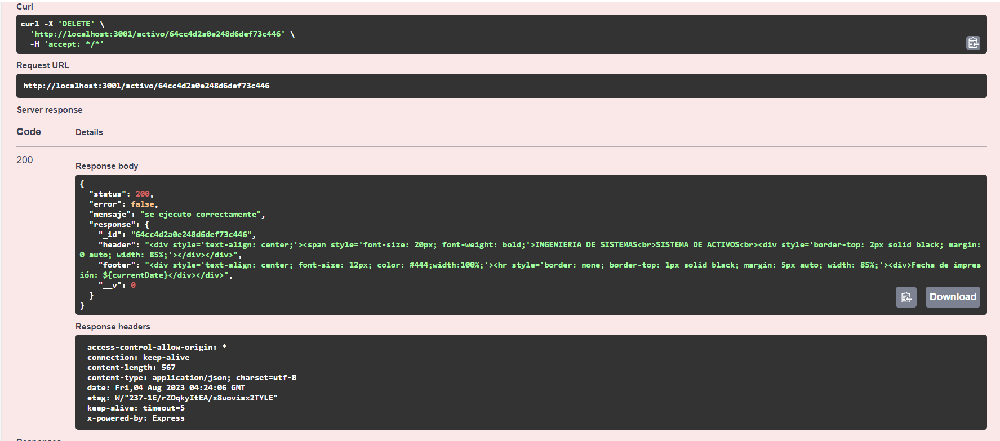

# Tutorial del uso ACTIVO
Primero lo primero este sistema lo que realizará es que cuando alguien envié un documento en **HTML en texto plano** o un **WORD en base64** se lo volverá en **PDF en base** pero antes de eso pondremos estilos **template** tendrá un pie de página y una cabecera y en la parte derecha e izquierda tendrán un espacio, estos estilos deben poder modificarse y están guardados en una base de datos y luego de poner el **template** lo volveremos en un **PDF en base 64** y enviarlo

Mostraremos el uso del Sistema en Swagger, lo primero será iniciar el sistema con **npm run start:dev**, ingresar a la url **http://10.10.214.219:3100/api** y tendremos los crud de activos y biblioteca 

## ACTIVO

En esta parte podemos observar el crud que se realizó en la parte de activo

Ahora explicaremos que ase cada uno, como se pudo observar dos **POST** y **GET** primero explicaremos la parte del que se encuentra el primer **POST**
### POST/activo

En esta parte se creará el **header** y el **footer** se lo pondra en texto plano como se ve en la imagen y se ejecute 

Como podemos observar se ejecutó correctamente ya que en el **status** salió **200** en la parte del **error** sale **falso** por qué no existió ningún error y en el **message** nos sale el mensaje de que **se ejecutó correctamente** y en **response** podremos ver lo que se introdujo y la **id** que se le asigno

### GET/activo
Aquí no ingresaremos ningún dato y pondremos **execute**

Solo será para ver la **id** de nuestro **template** o si existen varios pues se podrá ver todos con su respectivo templates y cómo podemos observar se ejecutó correctamente y esta el **template** que creamos con su **id** respectiva

### GET/activo/{id}

En esta parte es para poder buscar el template por las **ids** que desees verificar, pondremos de parámetro la **id**

como podemos observar se ejecuto correctamente y nos muestra la **id** y el **template**

### PUT/activo/{id}
Este crud será para modificar el **template** de la cabecera y el pie de página, 

aquí introduciremos la **id** que queremos modificar 

si no podemos la **id** no podremos modificar nuestro **header** y nuestro **footer** como se puede observar si o si se requiere ese parámetro

como aqui se puede observar todo salió correctamente en la modificación del **template**

### DELETE/activo/{id}
En este caso el crud será para eliminar el **template** y lo aremos mediante la **id**

como podemos observar se eliminó correctamente

y para verificar iremos al **GET/activo** y podemos observar que en nuestra base de datos no existe

### POST/activo/wordbase64-to-base64pdf
Este crud es el que convierte a de un **word a base64** o de un **html en texto plano** a un **pdf en base64**

en esta imagen se observa que se realiza la prueba con un **html en texto plano**

como podemos observar se ejecutó correctamente ya que nos devuelve en **pdf en base64**

Ahora se lo realiza con un **word en base64**

y cómo podemos observar se ejecutó correctamente en **pdf en base64**

