# Tutorial del uso BIBLIOTECA

Este **CRUD** es igual que el **crud de activos** solo cambia en el temmplate que debe ser distinto porque se almacena en otra base de datos y se le generara otra **id**
### POST/biblioteca
los parámetros que se requieren

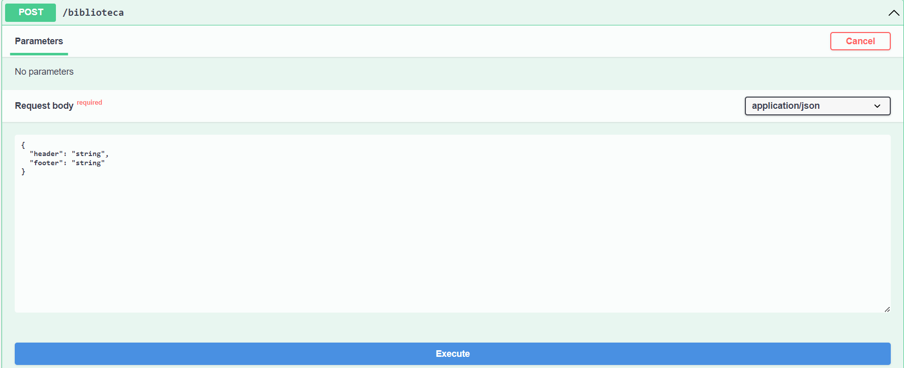

llenar con el **header** y el **footer**

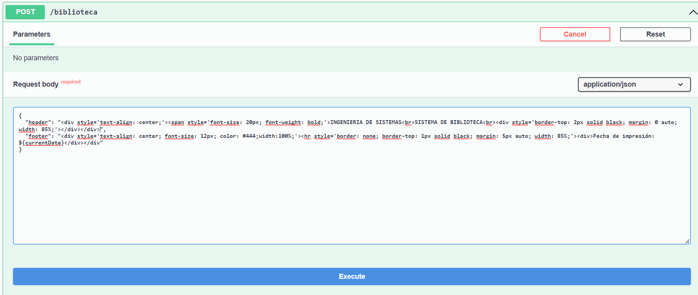

se creó con éxito en la **base de datos**

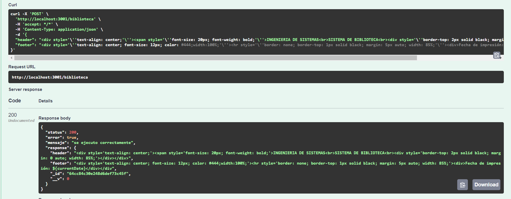

### GET/biblioteca
Mostrando datos de la base de datos

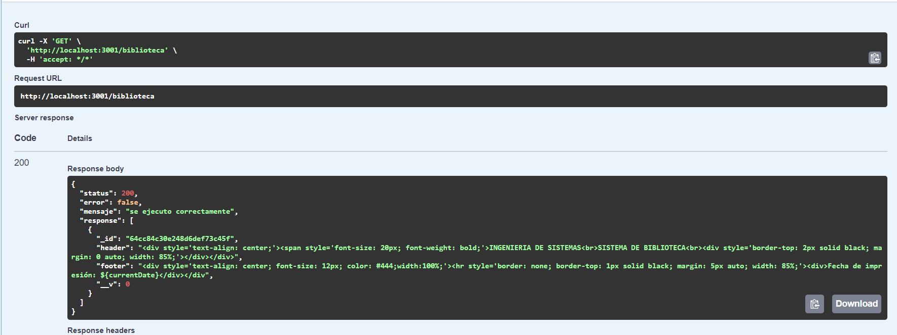

### GET/biblioteca/{id}
Buscando específicamente la **id** en la base de datos

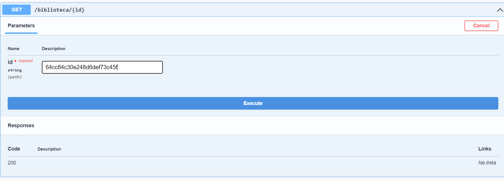

se muestra la id que se buscaba con toda la información

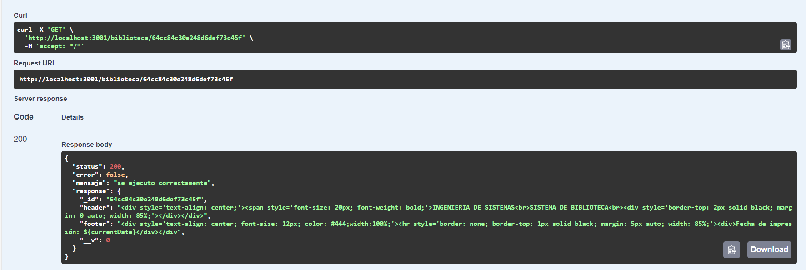

### PUT/biblioteca/{id}
Modificar el **header** y el **footer**

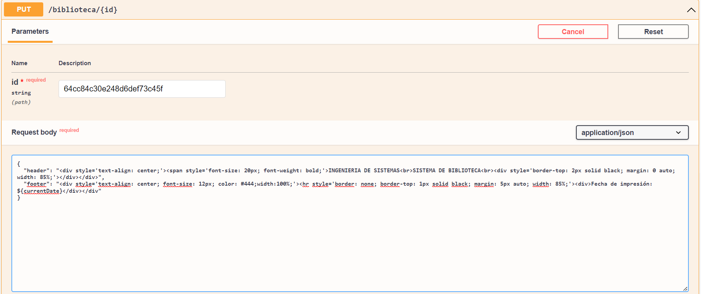

se modificó con éxito

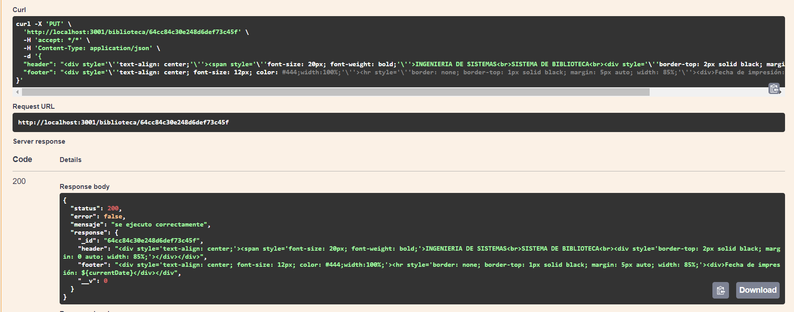

### DELETE/biblioteca/{id}
Eliminar el **template**

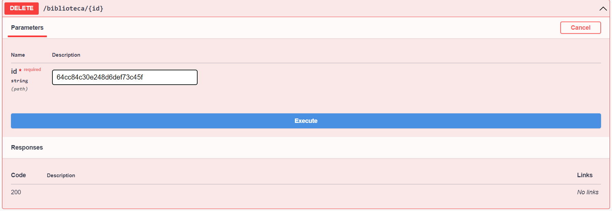

se eliminó con éxito

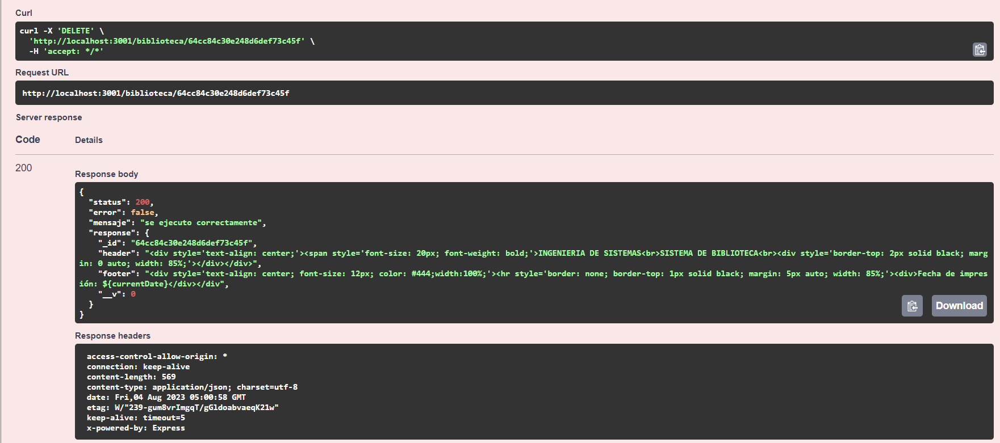

verificamos que se elimino

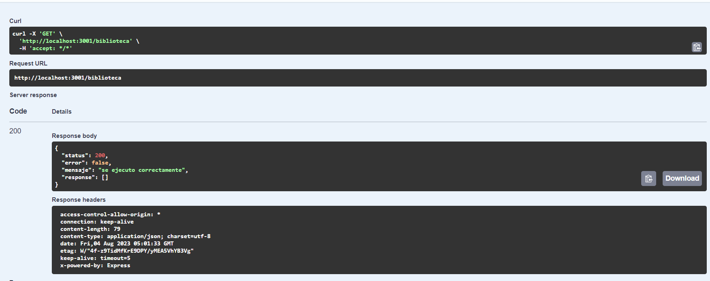

### POST/biblioteca/wordbase64-to-base64pdf
Introducir la **id** y el **html en texto plano**

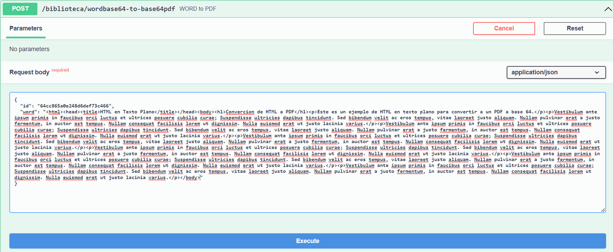

se convirtió con éxito el **html** a **PDF en base64**

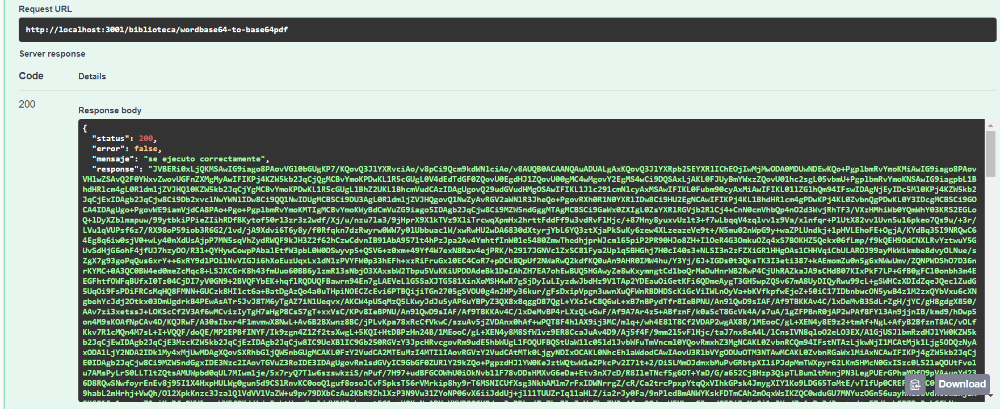

Ahora introduciremos la **id** con el **word en base64**

se convirtió exitosamente el documento **word en base64** a **pdf en base64**

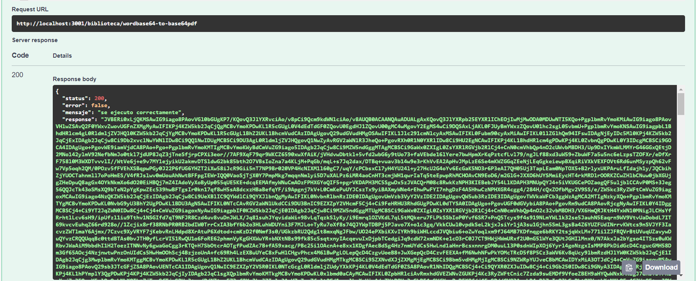
